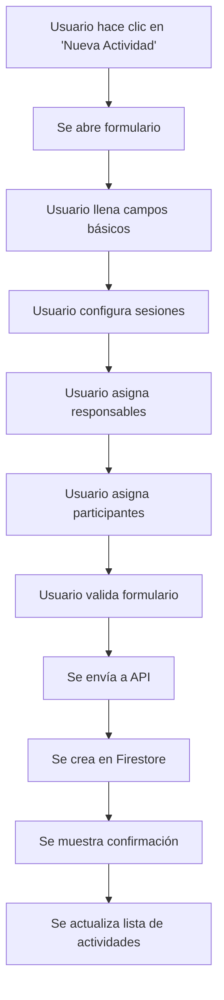
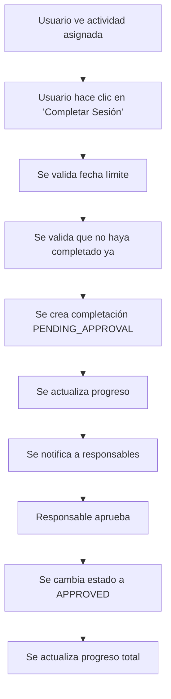
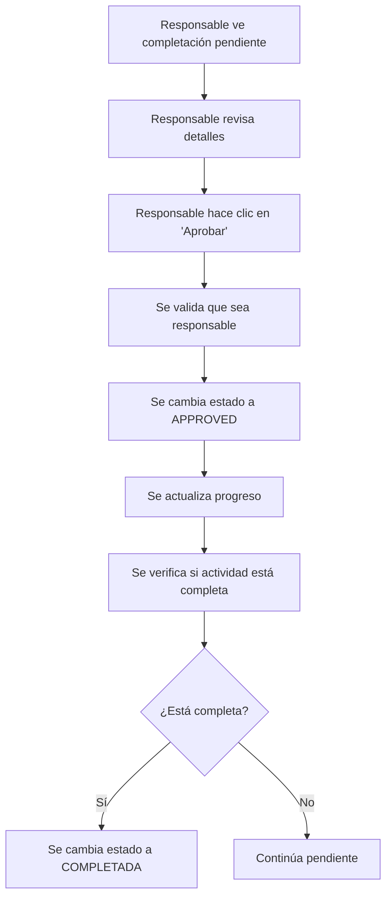
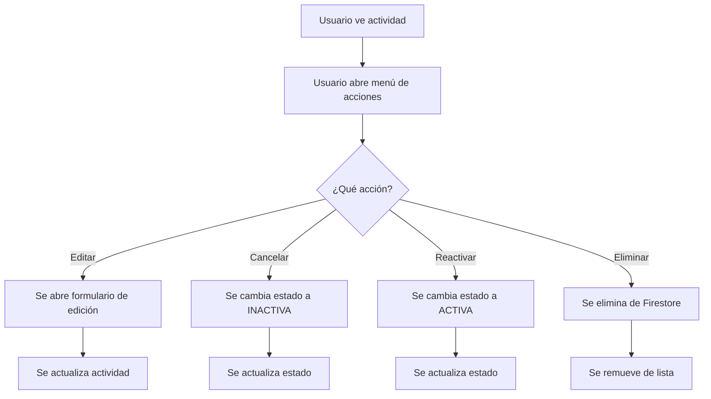

# Sistema de Actividades Educativas - Macondo Vivo
## Documentación Completa para Replicación en App Móvil

---

## 📋 Índice
1. [Vista General del Sistema](#vista-general-del-sistema)
2. [Arquitectura y Flujo de Datos](#arquitectura-y-flujo-de-datos)
3. [Interfaz de Usuario (UI/UX)](#interfaz-de-usuario-uiux)
4. [Sistema de Permisos y Roles](#sistema-de-permisos-y-roles)
5. [Formulario de Creación de Actividades](#formulario-de-creación-de-actividades)
6. [Sistema de Aprobación](#sistema-de-aprobación)
7. [Estados y Progreso](#estados-y-progreso)
8. [API Endpoints](#api-endpoints)
9. [Estructura de Datos](#estructura-de-datos)
10. [Flujos de Usuario](#flujos-de-usuario)

---

## 🎯 Vista General del Sistema

### Descripción
El sistema de actividades educativas permite crear, gestionar y participar en actividades educativas con un sistema de sesiones múltiples, aprobaciones y seguimiento de progreso.

### Características Principales
- ✅ **Creación de actividades** con múltiples sesiones
- ✅ **Asignación de participantes y responsables**
- ✅ **Sistema de aprobación por sesiones**
- ✅ **Seguimiento de progreso en tiempo real**
- ✅ **Estados de actividad (Activa, Completada, Inactiva)**
- ✅ **Calendario de actividades**
- ✅ **Búsqueda y filtrado**
- ✅ **Notificaciones y feedback**

---

## 🏗️ Arquitectura y Flujo de Datos

### Stack Tecnológico
- **Frontend**: Next.js 14 + React + TypeScript
- **UI Framework**: Material-UI (MUI)
- **Backend**: Next.js API Routes
- **Base de Datos**: Firebase Firestore
- **Autenticación**: Firebase Auth
- **Estado**: React Context + Hooks

### Flujo de Datos
```
Usuario → Frontend (React) → API Routes (Next.js) → Firebase Firestore
```

### Componentes Principales
- `ActivitiesPage` - Página principal de actividades
- `ActivityForm` - Formulario de creación/edición
- `ActivityDetailsDialog` - Vista detallada de actividad
- `ActivitiesCalendar` - Vista de calendario
- `activityService` - Servicio de lógica de negocio

---

## 🎨 Interfaz de Usuario (UI/UX)

### Página Principal de Actividades

#### Header y Navegación
```typescript
// Layout principal
<Container maxWidth="xl">
  <Typography variant="h4" component="h1" fontWeight="bold">
    Actividades Educativas
  </Typography>
  
  {/* Botón de nueva actividad (solo para usuarios autorizados) */}
  {canCreateActivity() && (
    <Button variant="contained" startIcon={<AddIcon />}>
      Nueva Actividad
    </Button>
  )}
</Container>
```

#### Barra de Búsqueda y Filtros
```typescript
<Paper sx={{ p: 3, mb: 3, borderRadius: 3 }}>
  <Grid container spacing={2} alignItems="center">
    {/* Campo de búsqueda */}
    <TextField
      fullWidth
      placeholder="Buscar actividades..."
      variant="outlined"
      size="small"
      InputProps={{
        startAdornment: <SearchIcon />
      }}
    />
    
    {/* Botones de filtro y calendario */}
    <Button startIcon={<FilterListIcon />}>Filtros</Button>
    <Button startIcon={<CalendarTodayIcon />}>Calendario</Button>
  </Grid>
</Paper>
```

#### Sistema de Pestañas
```typescript
<Tabs value={tabValue} onChange={handleTabChange}>
  <Tab label="Todas" />
  <Tab 
    icon={<MyActivitiesIcon />}
    label={`Mis Actividades (${userActivitiesStats.total})`}
  />
  <Tab label="Activas" />
  <Tab label="Completadas" />
  <Tab label="Inactivas" />
</Tabs>
```

#### Tarjetas de Actividades
```typescript
<Card sx={{ 
  borderRadius: 3,
  height: '100%',
  cursor: 'pointer',
  transition: 'all 0.4s cubic-bezier(0.4, 0, 0.2, 1)',
  '&:hover': {
    transform: 'translateY(-8px) scale(1.02)',
    boxShadow: '0 16px 32px rgba(0, 0, 0, 0.15)',
  },
  borderLeft: `5px solid ${getStatusColor(activity.status)}`
}}>
  <CardContent>
    {/* Estado y categoría */}
    <Chip 
      icon={getStatusIcon(activity.status)} 
      label={getStatusLabel(activity.status)} 
      size="small"
    />
    
    {/* Título y descripción */}
    <Typography variant="h6" fontWeight="bold">
      {activity.title}
    </Typography>
    
    {/* Información de sesiones */}
    <Box>
      <CalendarTodayIcon />
      <Typography>Próxima sesión: {formatDate(nextSession.date)}</Typography>
    </Box>
    
    {/* Responsables */}
    <Box>
      <Typography variant="caption">🎯 Responsables</Typography>
      {activity.responsibleUsers.map(responsible => (
        <Chip label={getUserInfo(responsible.userId)?.name} />
      ))}
    </Box>
    
    {/* Progreso */}
    <LinearProgress variant="determinate" value={progress} />
    <Typography>{progress}%</Typography>
    
    {/* Botones de acción */}
    <Button variant="outlined">Detalles</Button>
    <Button variant="contained">Completar Sesión</Button>
  </CardContent>
</Card>
```

### Diseño Responsivo
- **Desktop**: 3 columnas de tarjetas
- **Tablet**: 2 columnas de tarjetas  
- **Mobile**: 1 columna de tarjetas

### Animaciones y Transiciones
- **Fade in** para elementos principales
- **Grow** para botones de acción
- **Slide** para notificaciones
- **Hover effects** en tarjetas y botones

---

## 🔐 Sistema de Permisos y Roles

### Roles de Usuario
1. **SuperUser** - Acceso completo a todo el sistema
2. **ADMIN** - Puede crear y gestionar actividades (con restricciones)
3. **USER** - Puede participar y ver actividades asignadas

### Permisos por Funcionalidad

#### Creación de Actividades
```typescript
static canCreateActivities(user: User | null): boolean {
  if (!user) return false;
  return ['SuperUser', 'ADMIN'].includes(user.appRole);
}
```

#### Edición de Actividades
```typescript
static canEditActivity(user: User | null, activity: any): boolean {
  if (!user || !activity) return false;
  
  // SuperUser puede editar cualquier actividad
  if (user.appRole === 'SuperUser') return true;
  
  // ADMIN solo puede editar actividades que él creó
  if (user.appRole === 'ADMIN') {
    return activity.createdBy_uid === user.uid;
  }
  
  return false;
}
```

#### Visualización de Actividades
```typescript
// Usuarios normales solo ven actividades donde están asignados
const canViewActivity = (activity: Activity): boolean => {
  if (activity.status === 'INACTIVA') {
    // Solo SuperUser y ADMIN pueden ver actividades inactivas
    if (user?.appRole === 'SuperUser') return true;
    if (user?.appRole === 'ADMIN') {
      const isCreator = activity.createdBy_uid === user?.uid;
      const isResponsible = activity.responsibleUsers?.some(r => r.userId === user?.uid);
      return isCreator || isResponsible;
    }
    return false;
  }
  return true;
};
```

---

## 📝 Formulario de Creación de Actividades

### Estructura del Formulario

#### Campos Básicos
```typescript
interface ActivityFormData {
  title: string;                    // Título de la actividad
  description: string;              // Descripción (soporta HTML)
  numberOfSessions: number;         // Número de sesiones
  sessionDates: SessionDate[];      // Fechas y horarios de sesiones
  submissionLink: string;           // Enlace para entregas
  category: string;                 // Categoría educativa
  estimatedDuration: number;        // Duración estimada en minutos
  materials: string[];              // Lista de materiales
  objectives: string[];             // Objetivos de aprendizaje
  responsibleUserIds: string[];     // IDs de usuarios responsables
  participantIds: string[];         // IDs de participantes
}
```

#### Categorías Disponibles
```typescript
const categories = [
  'Literatura',
  'Ciencias Naturales', 
  'Matemáticas',
  'Historia',
  'Geografía',
  'Inglés',
  'Educación Física',
  'Artes',
  'Música',
  'Tecnología',
  'Convivencia',
  'Proyecto Transversal',
  'Otro'
];
```

### Validaciones
```typescript
const validateForm = (): boolean => {
  const errors: Record<string, string> = {};
  
  if (!formData.title.trim()) {
    errors.title = 'El título es requerido';
  }
  
  if (!formData.description.trim()) {
    errors.description = 'La descripción es requerida';
  }
  
  if (formData.numberOfSessions < 1) {
    errors.numberOfSessions = 'Debe tener al menos 1 sesión';
  }
  
  if (formData.sessionDates.length !== formData.numberOfSessions) {
    errors.sessionDates = 'El número de fechas debe coincidir con el número de sesiones';
  }
  
  // Validar fechas
  formData.sessionDates.forEach((session, index) => {
    if (!session.date) {
      errors[`session${index}Date`] = 'Fecha requerida';
    }
    if (!session.startTime) {
      errors[`session${index}StartTime`] = 'Hora de inicio requerida';
    }
    if (!session.endTime) {
      errors[`session${index}EndTime`] = 'Hora de fin requerida';
    }
  });
  
  setErrors(errors);
  return Object.keys(errors).length === 0;
};
```

### Gestión de Sesiones
```typescript
// Agregar nueva sesión
const handleAddSession = () => {
  const newSessionNumber = formData.sessionDates.length + 1;
  const newSession: SessionDate = {
    sessionNumber: newSessionNumber,
    date: dayjs().add(newSessionNumber, 'day').format('YYYY-MM-DD'),
    startTime: '08:00',
    endTime: '09:00',
    location: ''
  };
  
  setFormData(prev => ({
    ...prev,
    numberOfSessions: newSessionNumber,
    sessionDates: [...prev.sessionDates, newSession]
  }));
};

// Eliminar sesión
const handleRemoveSession = (index: number) => {
  setFormData(prev => ({
    ...prev,
    numberOfSessions: prev.numberOfSessions - 1,
    sessionDates: prev.sessionDates.filter((_, i) => i !== index)
  }));
};
```

### Asignación de Usuarios
```typescript
// Seleccionar responsable
const handleResponsibleUserSelect = (user: User) => {
  if (!formData.responsibleUserIds.includes(user.uid)) {
    setFormData(prev => ({
      ...prev,
      responsibleUserIds: [...prev.responsibleUserIds, user.uid]
    }));
  }
};

// Seleccionar participante
const handleUserSelect = (user: User) => {
  if (!formData.participantIds.includes(user.uid)) {
    setFormData(prev => ({
      ...prev,
      participantIds: [...prev.participantIds, user.uid]
    }));
  }
};
```

---

## ✅ Sistema de Aprobación

### Estados de Completación
```typescript
type CompletionStatus = 'PENDING_APPROVAL' | 'APPROVED' | 'COMPLETED';

interface SessionCompletion {
  sessionNumber: number;
  userId: string;
  completedAt: Date;
  isResponsible: boolean;
  status: CompletionStatus;
  approvedBy?: string;
  approvedAt?: Date;
}
```

### Flujo de Aprobación

#### 1. Participante Completa Sesión
```typescript
// El participante envía su completación
const newCompletion = {
  sessionNumber: nextSessionNumber,
  userId: participantId,
  completedAt: new Date(),
  isResponsible: false,
  status: 'PENDING_APPROVAL' // Requiere aprobación
};
```

#### 2. Responsable Aprueba
```typescript
// API endpoint para aprobar
POST /api/activities/{activityId}/approve
{
  "participantUserId": "user123",
  "sessionNumber": 1
}

// Actualizar estado
sessionCompletions[completionIndex] = {
  ...sessionCompletions[completionIndex],
  status: 'APPROVED',
  approvedBy: approvingUserId,
  approvedAt: new Date()
};
```

#### 3. Responsable Completa Su Sesión
```typescript
// Los responsables completan directamente (sin aprobación)
const newCompletion = {
  sessionNumber: nextSessionNumber,
  userId: responsibleId,
  completedAt: new Date(),
  isResponsible: true,
  status: 'COMPLETED' // No requiere aprobación
};
```

### Validaciones de Aprobación
```typescript
// Verificar que quien aprueba sea responsable
const isResponsible = activity.responsibleUsers?.some(r => r.userId === approvingUserId);
if (!isResponsible) {
  throw new Error('Solo los responsables pueden aprobar');
}

// Verificar que la completación esté pendiente
const completion = sessionCompletions.find(c => 
  c.userId === participantUserId && 
  c.sessionNumber === sessionNumber && 
  c.status === 'PENDING_APPROVAL'
);

if (!completion) {
  throw new Error('No se encontró completación pendiente');
}
```

---

## 📊 Estados y Progreso

### Estados de Actividad
```typescript
type ActivityStatus = 'ACTIVA' | 'COMPLETADA' | 'INACTIVA';

const getStatusColor = (status: ActivityStatus) => {
  switch (status) {
    case 'ACTIVA': return '#FF5722';      // Naranja
    case 'COMPLETADA': return '#4CAF50';  // Verde
    case 'INACTIVA': return '#9E9E9E';    // Gris
    default: return '#9E9E9E';
  }
};

const getStatusIcon = (status: ActivityStatus) => {
  switch (status) {
    case 'ACTIVA': return <AssignmentIcon />;
    case 'COMPLETADA': return <CheckCircleIcon />;
    case 'INACTIVA': return <ScheduleIcon />;
    default: return <AssignmentIcon />;
  }
};
```

### Cálculo de Progreso
```typescript
const calculateActivityProgress = (activity: Activity) => {
  // Solo contar PARTICIPANTES para el progreso (no responsables)
  const participantsOnly = activity.participants || [];
  const uniqueParticipants = participantsOnly.filter((user, index, self) => 
    index === self.findIndex(u => u.userId === user.userId)
  );
  
  const totalParticipants = uniqueParticipants.length;
  const totalSessions = activity.numberOfSessions;
  const totalRequiredCompletions = totalParticipants * totalSessions;
  
  // Contar completaciones válidas (APPROVED o COMPLETED)
  const participantUserIds = uniqueParticipants.map(p => p.userId);
  const validCompletions = activity.sessionCompletions?.filter(c => 
    participantUserIds.includes(c.userId) && 
    (c.status === 'APPROVED' || c.status === 'COMPLETED')
  ) || [];
  
  const currentCompletions = validCompletions.length;
  const completionPercentage = totalRequiredCompletions > 0 
    ? Math.round((currentCompletions / totalRequiredCompletions) * 100) 
    : 0;
  
  return {
    completionPercentage,
    currentCompletions,
    totalRequiredCompletions,
    isFullyCompleted: currentCompletions >= totalRequiredCompletions
  };
};
```

### Progreso por Usuario
```typescript
const getUserProgress = (activity: Activity, userId: string) => {
  const userCompletions = activity.sessionCompletions?.filter(c => 
    c.userId === userId
  ) || [];
  
  const completedSessions = userCompletions
    .filter(c => c.status === 'APPROVED' || c.status === 'COMPLETED')
    .map(c => c.sessionNumber);
  
  const nextSessionNumber = completedSessions.length + 1;
  const nextSession = activity.sessionDates?.find(s => 
    s.sessionNumber === nextSessionNumber
  );
  
  return {
    completedSessions,
    nextSession,
    totalSessions: activity.numberOfSessions,
    progress: (completedSessions.length / activity.numberOfSessions) * 100
  };
};
```

---

## 🔌 API Endpoints

### Obtener Todas las Actividades
```typescript
GET /api/activities
Headers: {
  'Authorization': 'Bearer {idToken}',
  'Content-Type': 'application/json'
}

Response: Activity[]
```

### Crear Actividad
```typescript
POST /api/activities
Headers: {
  'Authorization': 'Bearer {idToken}',
  'Content-Type': 'application/json'
}

Body: {
  title: string;
  description: string;
  numberOfSessions: number;
  sessionDates: SessionDate[];
  submissionLink?: string;
  category?: string;
  estimatedDuration?: number;
  materials?: string[];
  objectives?: string[];
  responsibleUsers: Participant[];
  participants: Participant[];
}

Response: {
  success: boolean;
  message: string;
  activity: Activity;
}
```

### Obtener Actividad por ID
```typescript
GET /api/activities/{activityId}
Headers: {
  'Authorization': 'Bearer {idToken}',
  'Content-Type': 'application/json'
}

Response: Activity
```

### Actualizar Actividad
```typescript
PUT /api/activities/{activityId}
Headers: {
  'Authorization': 'Bearer {idToken}',
  'Content-Type': 'application/json'
}

Body: Partial<Activity>

Response: {
  success: boolean;
  message: string;
}
```

### Eliminar Actividad
```typescript
DELETE /api/activities/{activityId}
Headers: {
  'Authorization': 'Bearer {idToken}',
  'Content-Type': 'application/json'
}

Response: {
  success: boolean;
  message: string;
}
```

### Completar Sesión
```typescript
POST /api/activities/{activityId}/complete
Headers: {
  'Cookie': 'session={sessionCookie}'
}

Response: {
  success: boolean;
  message: string;
  sessionNumber: number;
  activityProgress: {
    completionPercentage: number;
    isFullyCompleted: boolean;
    totalRequiredCompletions: number;
    currentCompletions: number;
  };
}
```

### Aprobar Sesión
```typescript
POST /api/activities/{activityId}/approve
Headers: {
  'Cookie': 'session={sessionCookie}'
}

Body: {
  participantUserId: string;
  sessionNumber: number;
}

Response: {
  success: boolean;
  message: string;
  sessionNumber: number;
  participantUserId: string;
  activityProgress: {
    completionPercentage: number;
    isFullyCompleted: boolean;
    totalRequiredCompletions: number;
    currentCompletions: number;
  };
}
```

---

## 📋 Estructura de Datos

### Activity
```typescript
interface Activity {
  activityId: string;
  title: string;
  description: string;
  numberOfSessions: number;
  sessionDates: SessionDate[];
  submissionLink?: string;
  category?: string;
  estimatedDuration?: number;
  materials?: string[];
  objectives?: string[];
  responsibleUsers: Participant[];
  participants: Participant[];
  status: 'ACTIVA' | 'COMPLETADA' | 'INACTIVA';
  adminCanEdit: boolean;
  createdBy_uid: string;
  createdAt: Date;
  updatedAt: Date;
  sessionCompletions?: SessionCompletion[];
  completionPercentage?: number;
}
```

### SessionDate
```typescript
interface SessionDate {
  sessionNumber: number;
  date: string;        // YYYY-MM-DD
  startTime: string;   // HH:mm
  endTime: string;     // HH:mm
  location?: string;
}
```

### Participant
```typescript
interface Participant {
  userId: string;
  status: 'PENDIENTE' | 'ACTIVO' | 'INACTIVO';
}
```

### SessionCompletion
```typescript
interface SessionCompletion {
  sessionNumber: number;
  userId: string;
  completedAt: Date;
  isResponsible: boolean;
  status: 'PENDING_APPROVAL' | 'APPROVED' | 'COMPLETED';
  approvedBy?: string;
  approvedAt?: Date;
}
```

---

## 🔄 Flujos de Usuario

### 1. Creación de Actividad (ADMIN/SuperUser)



### 2. Participación en Actividad (USER)



### 3. Aprobación de Sesión (Responsable)



### 4. Gestión de Estados (ADMIN/SuperUser)



---

## 🎨 Elementos Visuales y UX

### Colores del Sistema
```typescript
const colors = {
  // Estados de actividad
  active: '#FF5722',      // Naranja
  completed: '#4CAF50',   // Verde
  inactive: '#9E9E9E',    // Gris
  
  // Estados de sesión
  pending: '#FF9800',     // Naranja claro
  approved: '#2196F3',    // Azul
  
  // Progreso
  progressBar: '#FF5722', // Naranja principal
  
  // Botones
  primary: '#FF5722',
  success: '#4CAF50',
  warning: '#FF9800',
  error: '#F44336'
};
```

### Iconografía
```typescript
const icons = {
  // Estados
  active: <AssignmentIcon />,
  completed: <CheckCircleIcon />,
  inactive: <ScheduleIcon />,
  
  // Acciones
  create: <AddIcon />,
  edit: <EditIcon />,
  delete: <DeleteIcon />,
  complete: <CompleteActivityIcon />,
  approve: <ApprovalIcon />,
  
  // Navegación
  search: <SearchIcon />,
  filter: <FilterListIcon />,
  calendar: <CalendarTodayIcon />,
  
  // Información
  time: <AccessTimeIcon />,
  group: <GroupIcon />,
  link: <LinkIcon />
};
```

### Animaciones
```typescript
// Transiciones suaves
const transitions = {
  card: 'all 0.4s cubic-bezier(0.4, 0, 0.2, 1)',
  button: 'all 0.3s cubic-bezier(0.4, 0, 0.2, 1)',
  fade: 'opacity 0.3s ease-in-out',
  slide: 'transform 0.3s ease-in-out'
};

// Efectos hover
const hoverEffects = {
  card: {
    transform: 'translateY(-8px) scale(1.02)',
    boxShadow: '0 16px 32px rgba(0, 0, 0, 0.15)'
  },
  button: {
    transform: 'translateY(-2px)',
    boxShadow: '0 4px 12px rgba(255, 87, 34, 0.4)'
  }
};
```

---

## 📱 Consideraciones para App Móvil

### Adaptaciones Necesarias
1. **Navegación**: Cambiar de pestañas a navegación por stack
2. **Tarjetas**: Adaptar a lista vertical con swipe actions
3. **Formularios**: Usar modales nativos o pantallas completas
4. **Calendario**: Usar componente nativo de calendario
5. **Notificaciones**: Usar push notifications nativas

### Funcionalidades Específicas
1. **Offline**: Cachear actividades para uso sin conexión
2. **Sincronización**: Sincronizar cambios cuando hay conexión
3. **Cámara**: Permitir adjuntar fotos de evidencia
4. **GPS**: Validar ubicación para actividades presenciales
5. **Notificaciones**: Recordatorios de sesiones próximas

### Optimizaciones Móviles
1. **Lazy Loading**: Cargar actividades por lotes
2. **Imágenes**: Optimizar y cachear imágenes
3. **Gestos**: Implementar swipe para acciones rápidas
4. **Accesibilidad**: Soporte para lectores de pantalla
5. **Performance**: Minimizar re-renders y optimizar listas

---

## 🔧 Configuración y Deployment

### Variables de Entorno
```env
# Firebase
NEXT_PUBLIC_FIREBASE_API_KEY=your_api_key
NEXT_PUBLIC_FIREBASE_AUTH_DOMAIN=your_auth_domain
NEXT_PUBLIC_FIREBASE_PROJECT_ID=your_project_id
NEXT_PUBLIC_FIREBASE_STORAGE_BUCKET=your_storage_bucket
NEXT_PUBLIC_FIREBASE_MESSAGING_SENDER_ID=your_sender_id
NEXT_PUBLIC_FIREBASE_APP_ID=your_app_id

# Firebase Admin
FIREBASE_ADMIN_PROJECT_ID=your_project_id
FIREBASE_ADMIN_PRIVATE_KEY=your_private_key
FIREBASE_ADMIN_CLIENT_EMAIL=your_client_email
```

### Reglas de Firestore
```javascript
rules_version = '2';
service cloud.firestore {
  match /databases/{database}/documents {
    // Actividades
    match /activities/{activityId} {
      allow read: if request.auth != null;
      allow create: if request.auth != null && 
        (get(/databases/$(database)/documents/users/$(request.auth.uid)).data.appRole in ['ADMIN', 'SuperUser']);
      allow update: if request.auth != null && 
        (get(/databases/$(database)/documents/users/$(request.auth.uid)).data.appRole == 'SuperUser' ||
         (get(/databases/$(database)/documents/users/$(request.auth.uid)).data.appRole == 'ADMIN' && 
          resource.data.createdBy_uid == request.auth.uid));
      allow delete: if request.auth != null && 
        (get(/databases/$(database)/documents/users/$(request.auth.uid)).data.appRole == 'SuperUser' ||
         (get(/databases/$(database)/documents/users/$(request.auth.uid)).data.appRole == 'ADMIN' && 
          resource.data.createdBy_uid == request.auth.uid));
    }
  }
}
```

---

## 📚 Recursos Adicionales

### Archivos Importantes
- `src/app/dashboard/activities/page.tsx` - Página principal
- `src/components/activities/ActivityForm.tsx` - Formulario
- `src/components/activities/ActivityDetailsDialog.tsx` - Detalles
- `src/services/activityService.ts` - Lógica de negocio
- `src/app/api/activities/` - API endpoints
- `src/utils/permissions.ts` - Sistema de permisos

### Dependencias Principales
```json
{
  "@mui/material": "^5.x.x",
  "@mui/icons-material": "^5.x.x",
  "@mui/x-date-pickers": "^6.x.x",
  "dayjs": "^1.x.x",
  "firebase": "^10.x.x",
  "next": "^14.x.x",
  "react": "^18.x.x"
}
```

---

## 🎯 Conclusión

Este documento proporciona una guía completa para replicar el sistema de actividades educativas de Macondo Vivo en una aplicación móvil. El sistema está diseñado con una arquitectura escalable, permisos granulares y una experiencia de usuario intuitiva que puede adaptarse fácilmente a diferentes plataformas.

Los puntos clave a considerar en la implementación móvil son:
1. **Mantener la misma lógica de permisos y validaciones**
2. **Adaptar la UI/UX para pantallas táctiles**
3. **Implementar funcionalidades móviles específicas**
4. **Optimizar para rendimiento y uso offline**
5. **Mantener la consistencia con el sistema web**

Para cualquier duda o aclaración sobre la implementación, consultar los archivos fuente mencionados en la documentación. 